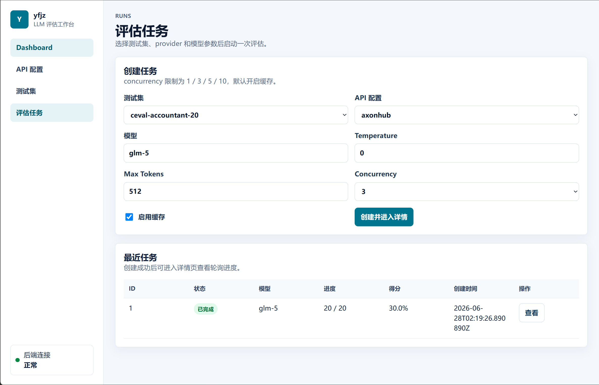
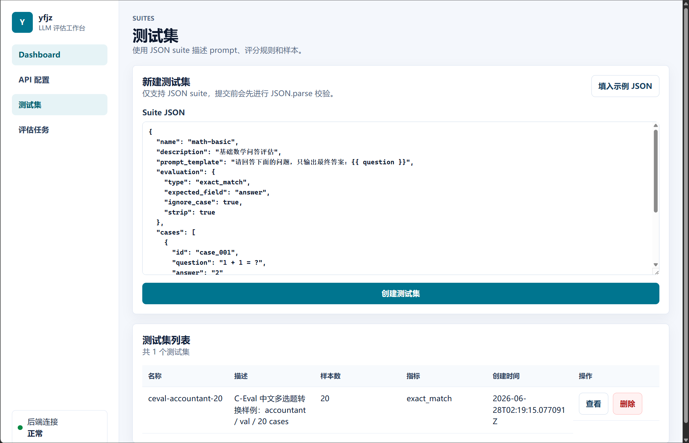
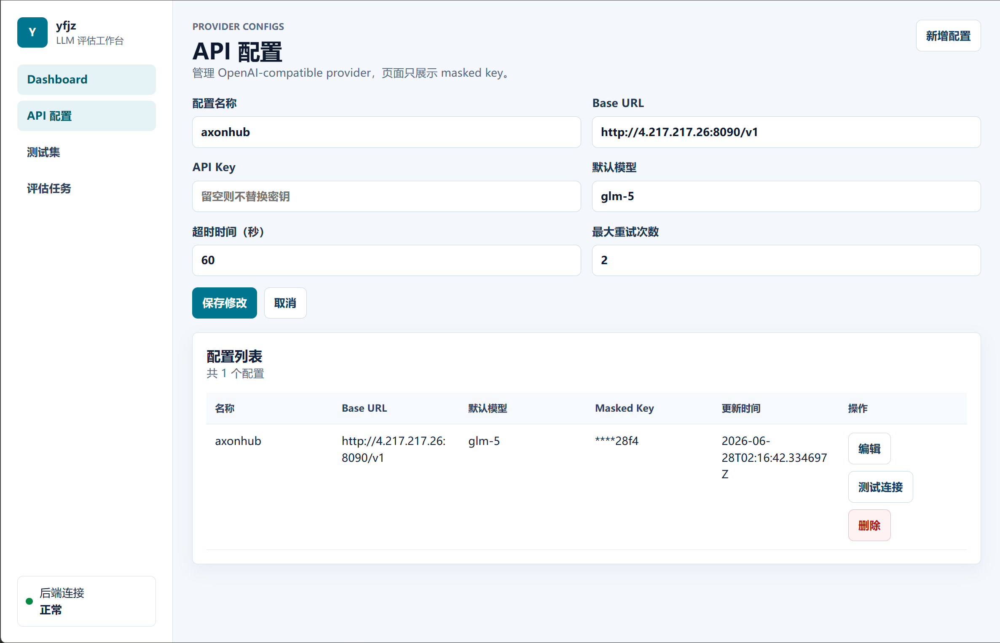
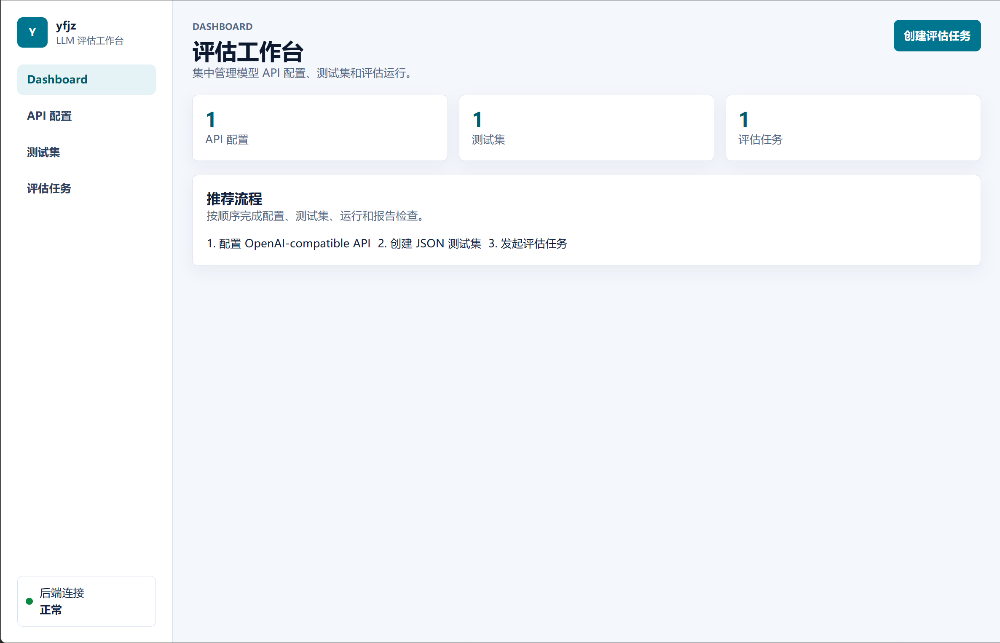

# yfjz

`yfjz` 是一个自定义 LLM 评估与基准测试平台，选题来自 `0628.md` 的问题二：自定义 LLM 评估与基准测试框架。

项目采用前后端分离结构：

- `backend/`：FastAPI 后端，负责 API 配置、测试集管理、异步评估、评分、缓存和 SQLite 持久化
- `frontend/`：Vue 3 + Vite 前端，负责 API 配置、测试集上传、评估任务创建、进度和报告展示
- `scripts/dataset/`：公开数据集下载与格式转换脚本
- `data/suites/`：已转换好的 JSON 测试集样例
- `docs/`：接口、测试集格式、前端页面和开发方案文档

## 环境要求

- Python 3.12+
- uv
- Node.js 22+
- npm 11+
- Git

如果 Windows PowerShell 中找不到 `uv`，可先安装：

```powershell
powershell -ExecutionPolicy ByPass -c "irm https://astral.sh/uv/install.ps1 | iex"
```

安装后重新打开终端，或在当前终端临时加入 PATH：

```powershell
$env:Path = "C:\Users\stf\.local\bin;$env:Path"
```

## 数据集说明

第一版平台只支持项目自定义的 JSON suite 格式。格式说明见：

- [docs/suite-format.md](./docs/suite-format.md)

当前已经准备了 C-Eval 中文多选题样例：

- [data/suites/ceval_accountant_20.json](./data/suites/ceval_accountant_20.json)：20 道会计题
- [data/suites/ceval_accountant_100.json](./data/suites/ceval_accountant_100.json)：100 道会计题

这些文件可以直接在前端“测试集”页面上传。

### 转换公开数据集

转换脚本位于：

- [scripts/dataset/convert_ceval.py](./scripts/dataset/convert_ceval.py)
- [scripts/dataset/README.md](./scripts/dataset/README.md)

脚本使用 Hugging Face 的 `ceval/ceval-exam` 数据集，并转换为本项目的 JSON suite 协议。

查看可用学科：

```powershell
cd D:\yfjz\backend
uv run --with datasets python ..\scripts\dataset\convert_ceval.py --list-subjects
```

生成 100 道会计题：

```powershell
cd D:\yfjz\backend
uv run --with datasets python ..\scripts\dataset\convert_ceval.py `
  --subject accountant `
  --split test `
  --limit 100 `
  --output ..\data\suites\ceval_accountant_100.json
```

说明：

- 原始 Hugging Face 数据会缓存到用户目录的 Hugging Face cache 中。
- 转换后的 JSON suite 会保存到项目的 `data/suites/`。
- `datasets` 只作为脚本临时依赖使用，不需要加入后端运行时依赖。


## 界面展示



* [ ]  





## 后端部署、启动与使用

后端位于 `backend/`，提供 FastAPI API、SQLite 本地持久化、JSON suite 管理、异步评估任务、结果缓存和 Typer CLI。

### 安装依赖

进入后端目录：

```powershell
cd D:\yfjz\backend
```

如果本机可用 `uv`：

```powershell
uv sync
```

如果 PowerShell 找不到 `uv`，但 Python 可以加载 uv：

```powershell
python -m uv sync
```

如果已经激活 `.venv`，并且遇到 `No module named uv`，说明当前虚拟环境中没有 `uv` 模块，此时直接使用虚拟环境里的命令即可，不需要再加 `python -m uv run`。

### 本地开发启动

未激活 `.venv` 时：

```powershell
python -m uv run uvicorn yfjz.app:app --reload --port 8000
```

已激活 `.venv` 时：

```powershell
uvicorn yfjz.app:app --reload --port 8000
```

或使用完整路径：

```powershell
.\.venv\Scripts\uvicorn.exe yfjz.app:app --reload --port 8000
```

健康检查：

```text
http://localhost:8000/health
```

预期返回：

```json
{"status": "ok", "service": "yfjz-backend"}
```

### 局域网/部署启动

如果前端或其他设备需要从局域网访问后端：

```powershell
uvicorn yfjz.app:app --host 0.0.0.0 --port 8000
```

前端 API Base URL 配置为：

```text
http://<后端机器IP>:8000/api
```

Windows 防火墙需要允许 Python/uvicorn 监听 8000 端口。后端默认允许 `localhost` / `127.0.0.1` 任意端口的本地前端跨域访问；跨机器或域名部署时，需要按部署域名调整 CORS 配置。

业务 API 文档：

- [docs/backend-api.md](./docs/backend-api.md)
- [docs/suite-format.md](./docs/suite-format.md)

后端默认使用 SQLite，数据库文件位于：

```text
backend/data/yfjz.sqlite3
```

可配置环境变量：

- `YFJZ_DATABASE_PATH`：SQLite 数据库路径
- `YFJZ_SECRET_KEY`：本地 API key 可逆混淆密钥

### 常用后端 API

- `GET /api/provider-configs`：查看 provider 配置
- `POST /api/provider-configs`：新增 OpenAI-compatible provider
- `GET /api/suites` / `POST /api/suites`：管理 JSON 测试集
- `POST /api/runs`：创建评估任务
- `GET /api/runs/{id}`：查看任务进度
- `GET /api/runs/{id}/results`：查看 case 结果

新增 provider 示例：

```powershell
Invoke-RestMethod `
  -Method Post `
  -Uri http://127.0.0.1:8000/api/provider-configs `
  -ContentType "application/json" `
  -Body '{
    "name":"axonhub",
    "base_url":"http://4.217.217.26:8090/v1",
    "api_key":"sk-...",
    "default_model":"glm-5",
    "timeout_seconds":60,
    "max_retries":2
  }'
```

API 响应只返回 `api_key_masked`，不会返回完整 `api_key`。

## 前端启动

进入前端目录并安装依赖：

```powershell
cd D:\yfjz\frontend
npm install
```

启动开发服务器：

```powershell
npm run dev
```

启动后访问 Vite 输出的本地地址，通常为：

```text
http://localhost:5173/
```

默认后端 API 地址为：

```text
http://localhost:8000/api
```

如需修改，在 `frontend/.env.local` 中配置：

```text
VITE_API_BASE_URL=http://localhost:8000/api
```

### 前端构建与部署

生产构建：

```powershell
cd D:\yfjz\frontend
npm ci
npm run build
```

构建产物输出到：

```text
frontend/dist/
```

部署时将 `frontend/dist/` 作为静态站点目录发布。部署环境需要注意：

- `VITE_API_BASE_URL` 应指向真实后端 API 地址，例如 `https://example.com/api`
- 前端使用 history 路由，静态服务器需要将未知路径回退到 `index.html`
- 后端需要允许前端部署域名的跨域请求

本地预览生产构建：

```powershell
cd D:\yfjz\frontend
npm run preview
```

## 使用流程

1. 启动后端服务。
2. 启动前端服务。
3. 打开前端页面，进入 Dashboard 查看后端健康状态、测试集数量、API 配置数量和最近运行记录。
4. 在“API 配置”中新增一个 OpenAI-compatible API：
   - `name`：自定义名称，例如 `OpenAI Official`
   - `base_url`：例如 `https://api.openai.com/v1`
   - `api_key`：模型服务 API Key
   - `default_model`：例如 `gpt-4o-mini`
5. 保存配置后点击“测试连接”，确认后端可以访问模型服务；API key 提交后页面只展示 masked key。
6. 在“测试集”页面上传 `data/suites/ceval_accountant_20.json` 或 `data/suites/ceval_accountant_100.json`。
7. 打开测试集详情页，检查 `prompt_template`、`evaluation` 和 cases 表格。
8. 在“评估任务”页面选择测试集、API 配置和模型。
9. 设置并发数、`temperature`、`max_tokens` 和是否启用缓存。
10. 创建任务后进入运行详情页，查看进度、评分、平均耗时、缓存命中和每道题的模型输出。
11. 再次运行同一任务时，如果启用缓存，命中缓存的 case 会复用模型原始输出。

## CLI 使用

后端提供 Typer CLI：

```powershell
cd D:\yfjz\backend
python -m uv run yfjz --help
python -m uv run yfjz list-suites
python -m uv run yfjz run --suite-id 1 --provider-config-id 1 --model gpt-4o-mini
python -m uv run yfjz show-run 1
```

CLI 复用后端评估逻辑，不单独实现一套评分流程。

已激活 `.venv` 时也可以直接运行：

```powershell
yfjz --help
```

## 测试与构建

后端测试：

```powershell
cd D:\yfjz\backend
python -m uv run pytest
```

已激活 `.venv` 时：

```powershell
python -m pytest
```

前端测试和构建：

```powershell
cd D:\yfjz\frontend
npm test
npm run build
```

## 项目结构

```text
.
├── backend/
│   ├── src/yfjz/
│   │   ├── api/
│   │   ├── core/
│   │   ├── evaluators/
│   │   ├── providers/
│   │   ├── runs/
│   │   ├── storage/
│   │   ├── suites/
│   │   └── tools/
│   ├── tests/
│   ├── pyproject.toml
│   └── uv.lock
├── frontend/
│   ├── src/
│   │   ├── api/
│   │   ├── components/
│   │   ├── router/
│   │   └── views/
│   └── package.json
├── scripts/
│   └── dataset/
├── data/
│   └── suites/
├── docs/
├── 0628.md
├── instruct.md
└── README.md
```

## 参考文档

- [docs/backend-api.md](./docs/backend-api.md)
- [docs/suite-format.md](./docs/suite-format.md)
- [docs/frontend-ui.md](./docs/frontend-ui.md)
- [scripts/dataset/README.md](./scripts/dataset/README.md)
- [instruct.md](./instruct.md)
